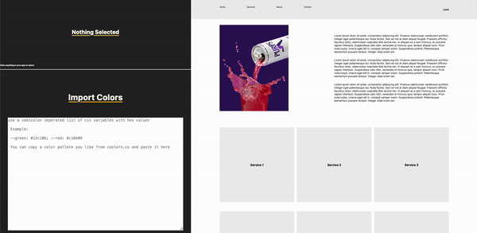
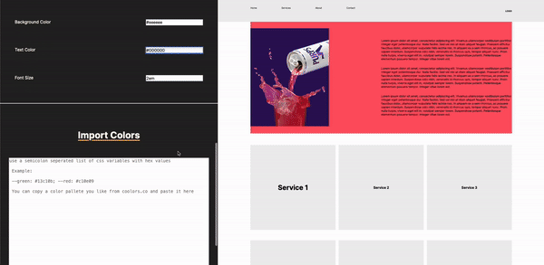

# React Color Visualiser

> React Color Visualiser is a development tool that helps temporarily manipulate the CSS in your application to test out different color palletes and styles

## Prerequisites

This project requires NodeJS (version 8 or later) and NPM.
[Node](http://nodejs.org/) and [NPM](https://npmjs.org/) are really easy to install.
To make sure you have them available on your machine,
try running the following command.

```sh
$ npm -v && node -v
6.4.1
v8.16.0
```

## Table of contents

- [React Color Visualiser](#react-color-visualiser)

  - [Prerequisites](#prerequisites)
  - [Table of contents](#table-of-contents)
  - [Getting Started](#getting-started)
  - [Installation](#installation)
  - [Usage](#usage)
  - [Built With](#built-with)
  - [License](#license)

## Getting Started

These instructions will get you a copy of the project up and running on your local machine for development and testing purposes. See deployment for notes on how to deploy the project on a live system.

## Installation

**BEFORE YOU INSTALL:** please read the [prerequisites](#prerequisites)

To install and set up the library, run:

```sh
$ npm install -d react-color-visualiser
```

Or if you prefer using Yarn:

```sh
$ yarn add --dev react-color-visualiser
```

## Usage

### Wrap your application

```sh

import ReactColorVisualiser from 'react-color-visualiser';
import 'react-color-visualiser/lib/main.css'

...

return (
    <ReactColorVisualiser>
        <App/>
    </ReactColorVisualiser>
)

```

### Click anywhere in your application and the selected node will show in the control panel



### You can import color palettes for websites like Coolors for testing different themes



## Built With

- React.js
- Rollup
- SASS

## License

MIT License © Mazen Alswar
